## 자율 주행 기반 커넥티드카 셰어링 서비스 선행 개발 :car:

> T4IR DeCoCa조 : 안소현(PM) 이경헌(PL) 강용욱 백승엽 조민경 황성민

[View Report](https://github.com/xuansohx/FinalProject/blob/master/Report/191031_2%EC%A1%B0_%EC%B5%9C%EC%A2%85%EB%B0%9C%ED%91%9C.pdf)  [View Demo Video](https://github.com/xuansohx/FinalProject/tree/master/Video)

- **프로젝트 개요 :**

자율주행차량이 상용화된다는 전제하에 어떠한 서비스가 필요할지 생각하며 기획

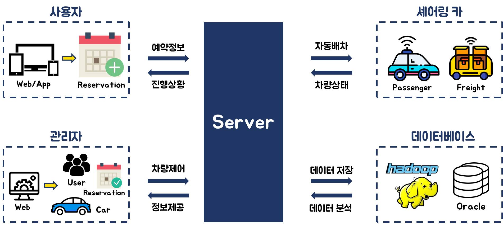

- **사용하는 기술 :**

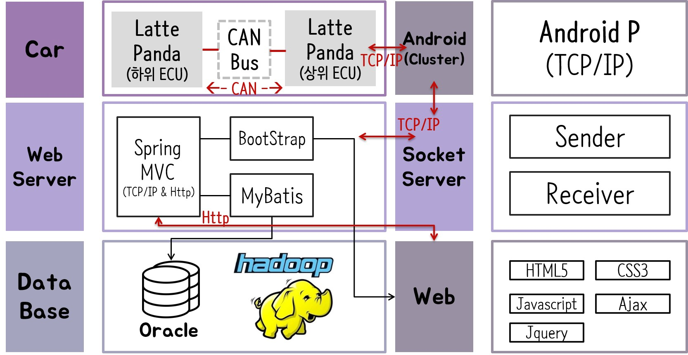

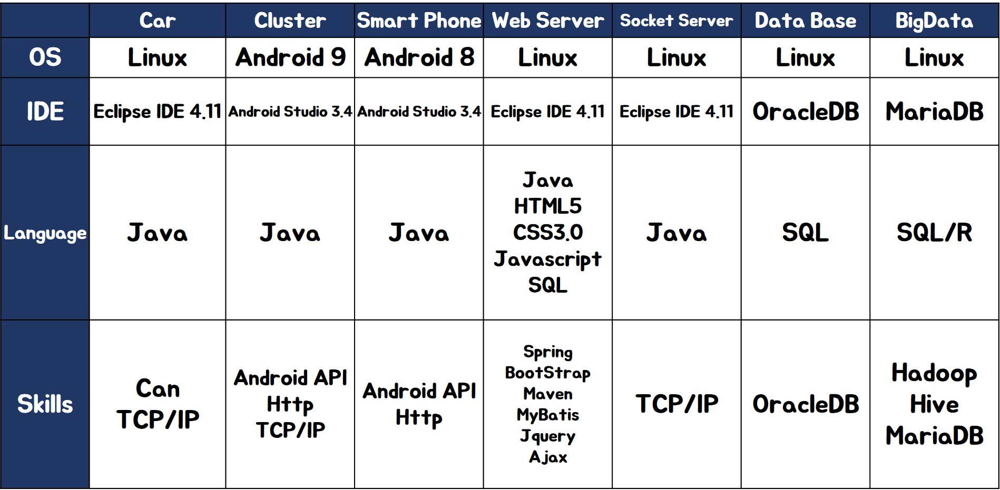

- **시스템 구성도 :**

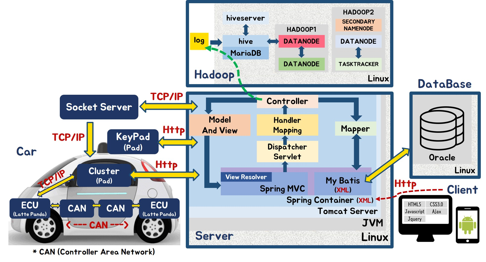

- **프로젝트 환경 :**

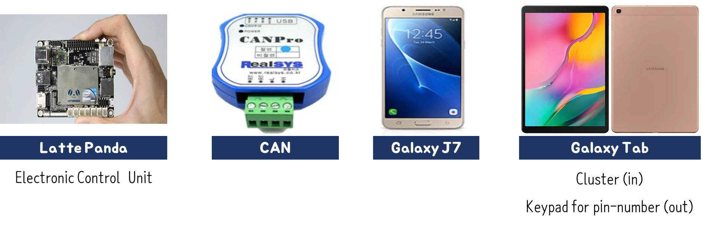

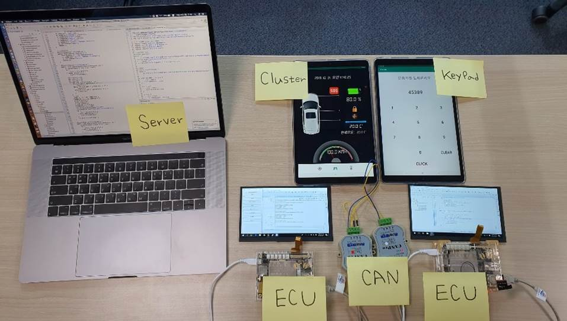

- **CAN 통신 규약 :**

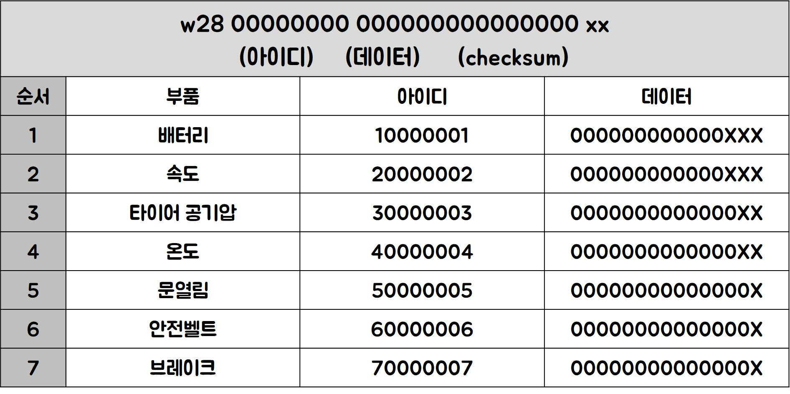

- **Entity-Relationship Diagram (ERD) :**

.jpg)

- **주요 기능 :**

서비스 예약하기 (스마트택시 / 픽업 / 퀵 서비스)

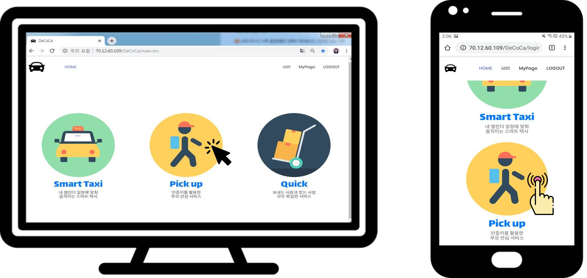

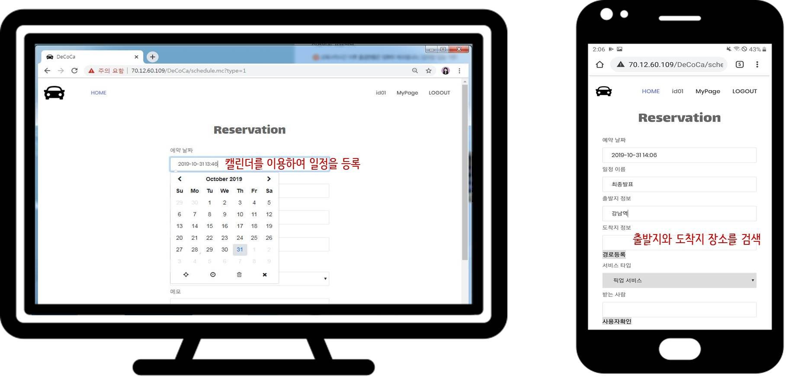

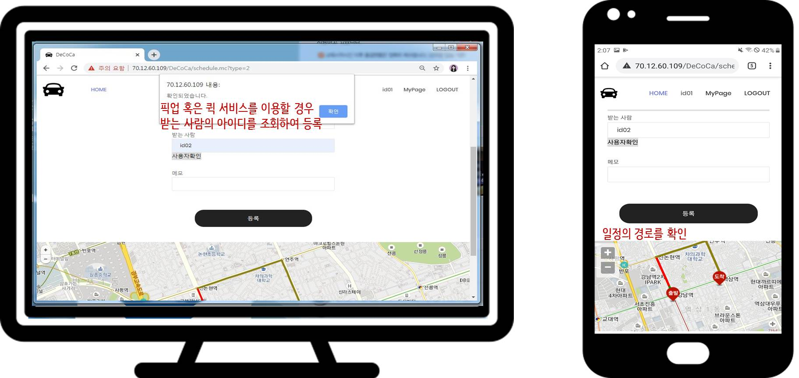

푸쉬알림메시지 수신

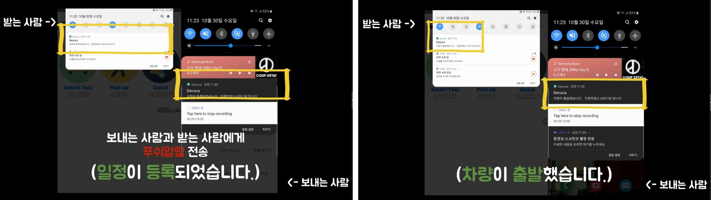

> 'FCM(Firebase Cloud Messaging)' 서비스를 활용하여 푸쉬 기능 구현 (디바이스토큰 이용)

인증번호를 활용하여 사용자와 차량의 신뢰성 향상

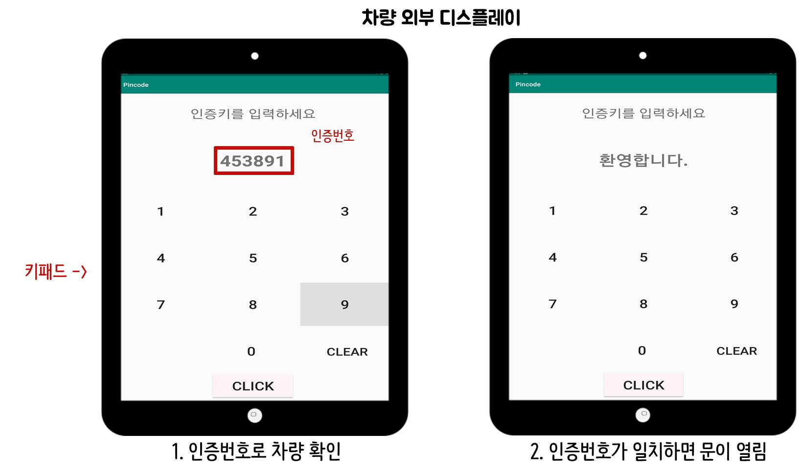

> 픽업 또는 퀵 서비스를 이용할 경우, 서비스를 예약한 사람 + 받는 사람 + 차량의 인증키가 일치해야됨

관리자 웹을 통하여 차량제어

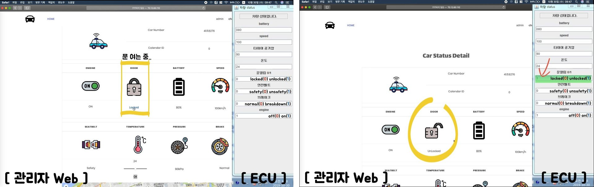

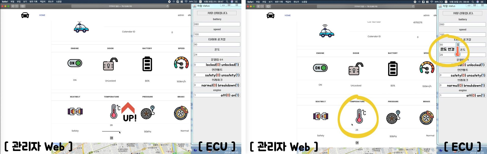

> 관리자 웹에서 차량에 명령을 내리면 Http → TCP/IP → CAN 통신을 거쳐 차량으로 전달되어 수행

관리자 웹에서 사용자 로그 분석하여 시각화


> Hadoop을 활용하여 사용자의 log 데이터를 수집한 후, R로 분석하여 데이터를 시각화 하여 화면에 나타냄

<br>

- **git을 활용한 프로젝트 관리** (git 에 `push` 할 때 주의할 점)​

:heavy_check_mark: git bash 접속해서 `git pull`을 먼저하기

:heavy_check_mark: `master` 권한으로 올리지 않기 → `branch` 생성해서 `push` 하기

:heavy_check_mark: `branch` 이름은 자신이 맡은 역할을 나타낼 수 있도록 만듦

> 오늘 calendar 작업을 했으면, branch 이름은 `calendar`

> `commit message`에 날짜와 함께 작업 내용 상세하게 기록해주세요 :smile:

```
git branch 브랜치명 → branch 생성
git branch → 현재 접속 된 branch 확인
git checkout 브랜치명 → 해당하는 branch로 접속

git push origin 브랜치명
→ 접속된 `branch`로 push 하는 법 (저장소 이름인 'origin' 뒤에 branch 이름 써서 push 하기)
```

